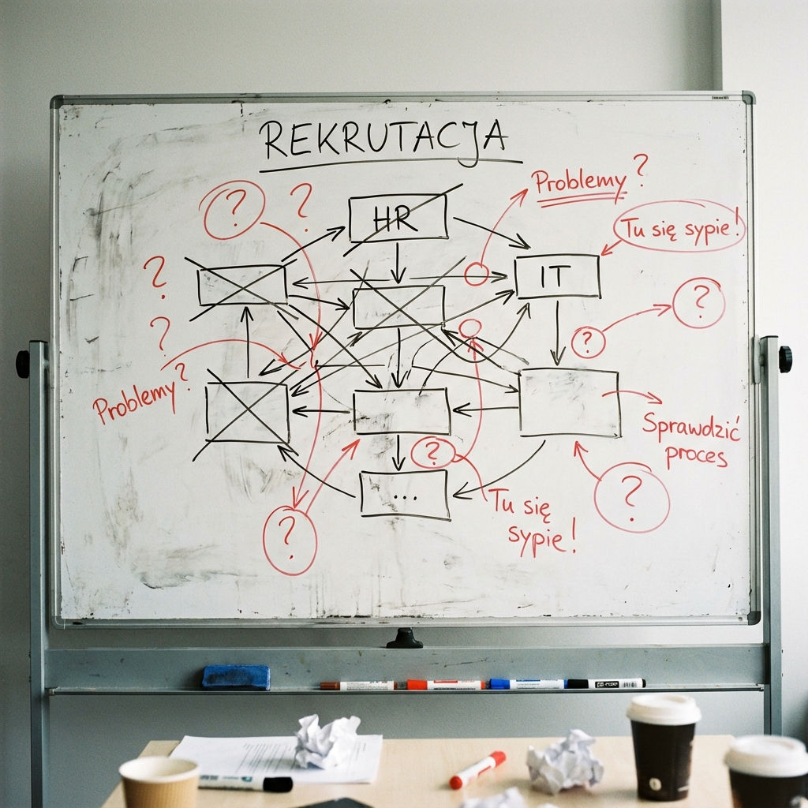

# SYMULACJA USŁUGI V2: SPARK MAPPING LITE™ (Visual Focus)

**Data:** 2025-12-09
**Uczestnicy:**
- KONSULTANT SPARK
- KLIENT: Tomek (CEO Software House "CodeWave", 45 osób)
**Proces:** "Rekrutacja Programisty (Mid/Senior)"

---

## FAZA 1: "BRUDNOPIS POD PRESJĄ" (00:00 - 00:30)
*Cel: Zrozumienie chaosu i narysowanie stanu faktycznego (As-Is).*

**KONSULTANT:** Tomku, startujemy. Rekrutacja. Kiedy proces się zaczyna?
**KLIENT:** Jak PM zgłasza zapotrzebowanie.
**KONSULTANT:** Gdzie zgłasza?
**KLIENT:** Na Slacku, albo dzwoni do HR.
**KONSULTANT:** (Rysuje koślawy prostokąt "ZGŁOSZENIE") Ok. Co dalej?
**KLIENT:** HR wrzuca ogłoszenie na JustJoinIT.
**KONSULTANT:** Od razu? Bez akceptacji budżetu?
**KLIENT:** A, no tak. Muszę ja zatwierdzić. Ale czasem zapominam odpisać na Slacku, więc HR czeka 3 dni.
**KONSULTANT:** (Rysuje czerwoną strzałkę "CZEKANIE NA CEO" i wykrzyknik). Mamy pierwsze wąskie gardło.
**KLIENT:** Potem spływają CV. HR robi wstępną selekcję i wysyła mi najlepsze na maila.
**KONSULTANT:** Na maila? A gdzie trzymacie resztę?
**KLIENT:** Na dysku Google.
**KONSULTANT:** (Dopisuje "GDPR RISK?" na marginesie). Ok. Co dalej?
**KLIENT:** Techniczni robią rozmowę.
**KONSULTANT:** Kto konkretnie?
**KLIENT:** Zależy kto ma czas. Czasem Junior sprawdza Seniora... to jest słabe.
**KONSULTANT:** (Rysuje "??? KWALIFIKACJE Tech?").

**WYNIK FAZY 1: SZKIC ROBOCZY (Brudnopis)**
*Konsultant rysuje na whiteboardzie, zaznaczając problemy. Używamy prostych form, żeby nie spłoszyć klienta.*

*Notatki na marginesie: "RODO!!", "Jaki budżet?", "Junior sprawdza Seniora??".*

---

## FAZA 2: "PORZĄDKOWANIE STRUKTURY" (00:30 - 00:60)
*Cel: Ułożenie faktów w proces logiczny, przygotowanie do diagnozy.*

**WYNIK FAZY 2: DRAFT LOGICZNY (Struktura)**
*Porządkujemy role i artefakty:*

**DIAGNOZA AS-IS:**
- **Ból główny:** Techniczni tracą czas na słabych kandydatów.
- **Granice:** Proces startuje niejasnym sygnałem na Slacku (brak Artefaktu "Brief").
- **Role:** Tech Lead działa jako filtr, zamiast rekrutować.

---

## FAZA 3: "PRODUKT KOŃCOWY" (Post-Meeting)
*Cel: Dostarczenie wartości Premium.*

**WYNIK FAZY 3: FINALNA MAPA PROCESU**
*(Zobacz pełny diagram w pliku `example_client_report.md`)*

---
**Podsumowanie Symulacji:**
Kluczem było wizualne pokazanie klientowi "bałaganu" na żywo (Faza 1), a potem dostarczenie "spokoju" w postaci uporządkowanej mapy (Faza 3). To buduje zaufanie niezbędne do sprzedaży wdrożenia (Phase 2 - Fix).
